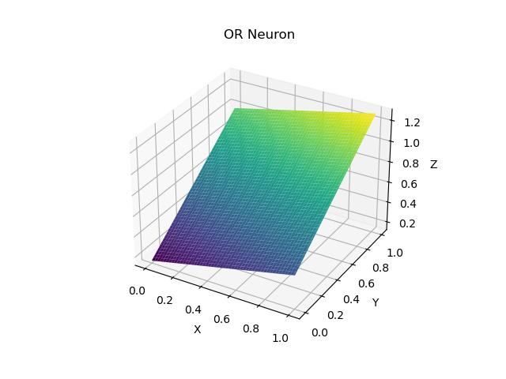
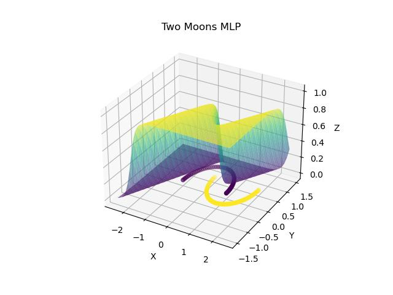
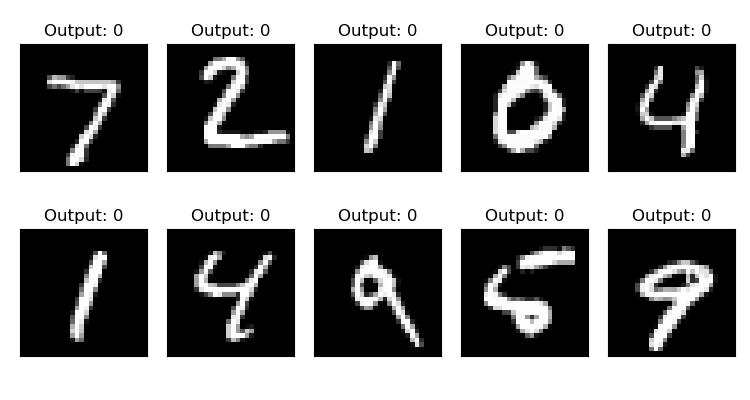

<div align="center">
<h1>
    <div>cudagrad</div>
</h1>

CUDA C++ strided float tensor automatic differentiation engine with Python bindings

<h4>
    <div>
        <a href='https://github.com/yrmo/cudagrad'>Repository</a> – <a href='./Tensor.ipynb'>Documentation</a>
    </div>
</h4>
</div>

# Install

This project is available on [PyPI](https://pypi.org/project/cudagrad/), but requires `cmake` and `nvcc` to be available at installation time:

```
pip install cudagrad
```

# Examples

The following examples were written purely in Python using only `cudagrad.Tensor` for learning

## Neuron

### OR



[`/examples/or.py`](https://github.com/yrmo/cudagrad/blob/main/examples/or.py)

## Multilayer perceptron (MLP)

### XOR


[`/examples/xor.py`](https://github.com/yrmo/cudagrad/blob/main/examples/xor.py)

### Two moons



[`/examples/moons.py`](https://github.com/yrmo/cudagrad/blob/main/examples/moons.py)

## Convolutional neural network (CNN) WIP!

### MNIST



[`/examples/mnist.py`](https://github.com/yrmo/cudagrad/blob/main/examples/mnist.py)

# Performance

| Dataset | Time (seconds) |
|---------|----------------|
| or | 0.57 |
| xor | 4.83 |
| moons | 12.79 |
