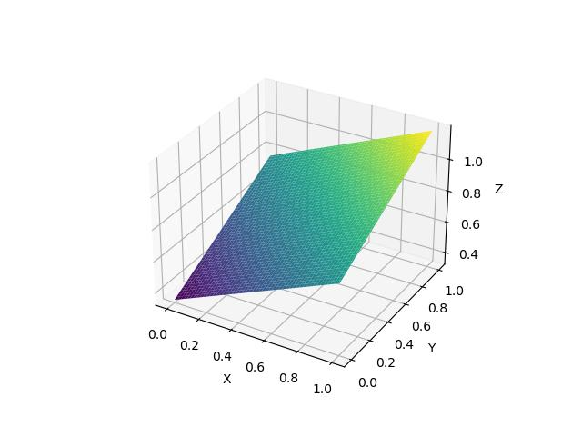
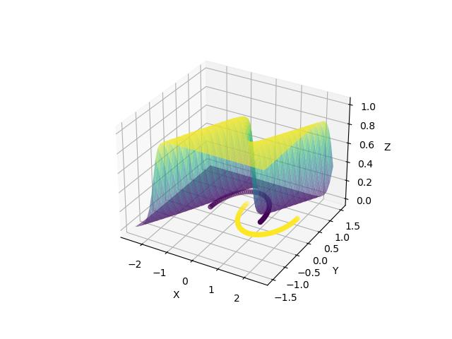
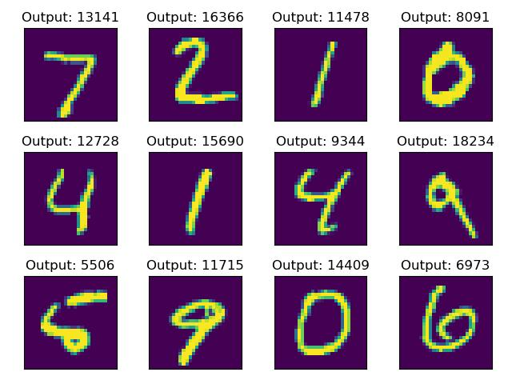

<div align="center">
<h1>
    <div>cudagrad</div>
</h1>

CUDA C++ strided float tensor automatic differentiation engine with Python bindings

</div>

# Install

```
pip install cudagrad
```

# Examples

The following examples were written purely in Python using only [`cudagrad.Tensor`](./Tensor.ipynb) for learning:


### OR



[`/benchmarks/_cudagrad/or.py`](https://github.com/yrmo/cudagrad/blob/main/benchmarks/_cudagrad/or.py) (+0.0% faster than `torch`)


### XOR


[`/benchmarks/_cudagrad/xor.py`](https://github.com/yrmo/cudagrad/blob/main/benchmarks/_cudagrad/xor.py) (+0.0% faster than `torch`)


### MOONS



[`/benchmarks/_cudagrad/moons.py`](https://github.com/yrmo/cudagrad/blob/main/benchmarks/_cudagrad/moons.py) (+0.0% faster than `torch`)


### MNIST



[`/benchmarks/_cudagrad/mnist.py`](https://github.com/yrmo/cudagrad/blob/main/benchmarks/_cudagrad/mnist.py) (+0.0% faster than `torch`)

