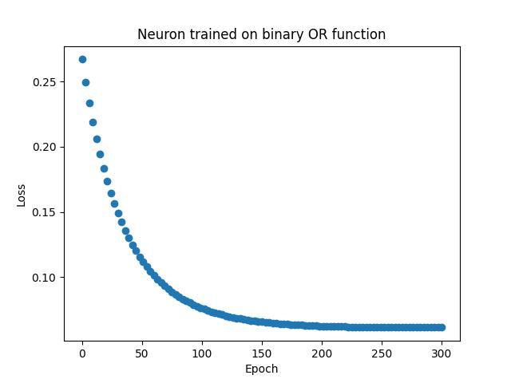
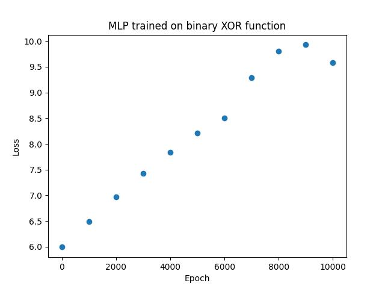

# cudagrad

Tensor-valued autograd engine for Python

# Docs

In-depth `cudagrad.Tensor` documentation can be found in [Tensor.ipynb](./Tensor.ipynb)

# Examples

The following examples were written purely in Python using only `cudagrad.Tensor` for learning. See `__main__` guards in `cudagrad/cudagrad/` for usage examples, below are the loss function plots:

## Neuron/Linear

## Multilayer perceptron

Work in progress!

